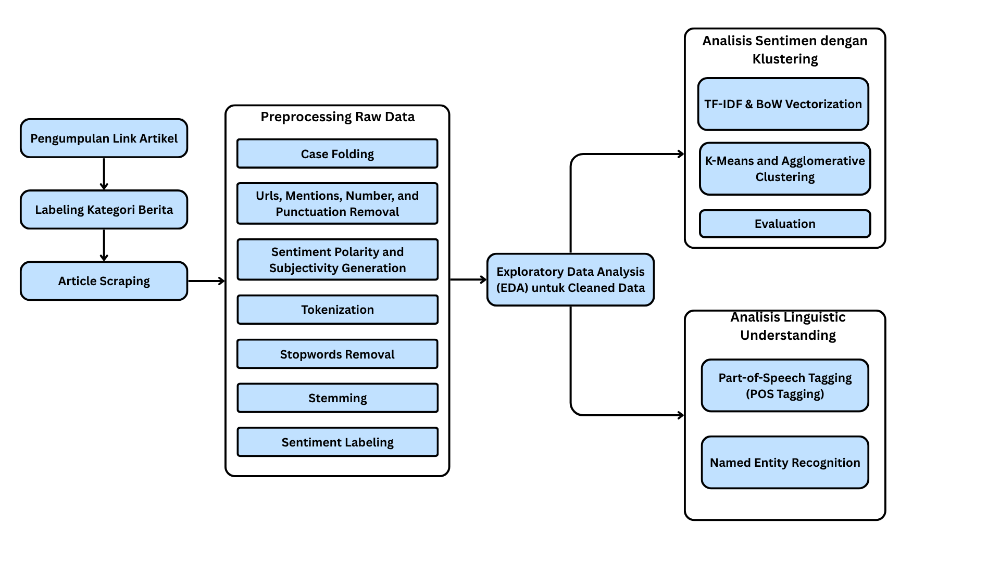

# Sentiment Analysis for Lion Air News Articles
This project provides a comprehensive sentiment analysis of news articles concerning Lion Air. The primary goal is to evaluate public perception and media portrayal of the airline by systematically collecting and processing a dataset of news reports. Using NaturalLanguage Processing (NLP) techniques, this analysis automatically classifies articles as positive, negative, or neutral, offering insights into the prevailing opinions and tracking sentiment trends related to the airline's operations, incidents, and public relations.
<br><br>
## 🗒️ Paper Information
Title | Author | Date
---|---|---
Analisis Sentimen untuk Artikel Berita : Studi Kasus Lion Air | Ahmad Fadhino Tegar Permana, Nur Ghulam Musthafa Al Kautsar, Dafa Fawwaz Alfarisi | ??/??/????

## 📂 Project Structure
```bash
sentiment-analysis-Lion-Air/
├── notebook
│   ├── 1_Articles_preprocessing.ipynb
│   ├── 2_Articles_EDA.ipynb
│   ├── 3_Articles_Sentiment_Analysis.ipynb
│   ├── 4_Articles_POS_NER.ipynb
│   └── data
│       ├── articles_raw.csv
│       └── cleaned_article.csv
└── scrapping_script
    └── main.py
```

## 🎯 Research Objective
The primary aim of this research is to comprehensively analyze the sentiment and thematic content of online news articles related to Lion Air.
<br>
To achieve this, the following specific objectives have been established:
- **To analyze and quantify public sentiment** towards Lion Air as reflected in online news articles, classifying each article as positive, negative, or neutral using the TextBlob library.
- **To compile a diverse dataset** by systematically scraping over 150 news articles concerning Lion Air from various online media sources.
- **To perform Exploratory Data Analysis (EDA),** generating visualizations to provide a clear understanding of sentiment distribution, key topics, and temporal trends.
- **To identify and group underlying themes** within the news corpus by applying unsupervised clustering algorithms, specifically DBSCAN, K-Means, and Agglomerative Clustering, using both Bag-of-Words (BoW) and TF-IDF feature extraction methods.
- **To conduct a detailed linguistic analysis** of the articles, employing Part-of-Speech (POS) tagging and Named Entity Recognition (NER) to extract key entities (such as people, organizations, and locations) and understand the grammatical context driving the sentiment.

## 📊 Dataset Features
- ```Kategori```: Category of Article Scraped
- ```Link```: Link of the Article
- ```article_title```: The title of news article
- ```article_text```: The content of the article
- ```domain```: the domain / channel of the article
- ```cleaned_article_text```: preprocessed article content 
- ```polarity```: polarity of the article
- ```subjectivity```: subjectivity score of the article
- ```tokens```: tokenized word after removing Urls, mentions, numbers, and punctuation
- ```tokens_no_stop```: tokenized word after stopwords removal using ```stopwords.words('indonesian')```
- ```tokens_final```: tokenized word after stopwords removal using custom stopwords
- ```tokens_stemmed```: tokenized word after stemming using ```StemmerFactory``` from ```PySastrawi```
- ```text_final```: merged/joined tokens into text
- ```sentiment_label```: sentiment labeling based on polarity score
- ```pos_tags```: tagged tokens based on Part-of-Speech
- ```ner_tags```: tagged tokens based Named Entity
## 🪜 Methodology
<br><br>

## 💡 Key Insights
- The **K-Means model** achieved a slightly higher **Silhouette** and **Calinski-Harabasz** score, suggesting a marginally better-defined cluster structure compared to Agglomerative clustering.
- However, the **Agglomerative model’s lower Davies-Bouldin score (1.079)** indicates that its clusters are more compact and better separated.
- Overall, both models reflect that **the dataset has limited natural separability**, implying that sentiment distinctions within the articles are subtle and may benefit from more refined preprocessing, feature engineering, or semi-supervised methods.

## ✅ Conclusion
The analysis indicates that while basic text vectorization and clustering can capture certain grouping tendencies, **sentiment patterns in real-world news data are nuanced and context-dependent**.
Future improvements could include:
- Incorporating pretrained embeddings (e.g., Word2Vec, FastText, or BERT) for richer semantic understanding.
- Applying dimensionality reduction (e.g., PCA or t-SNE) to visualize and interpret cluster structure.
- Introducing semi-supervised or supervised sentiment classification to validate and refine cluster meaning.
- Expanding the dataset with more diverse and time-spanning articles for stronger generalization